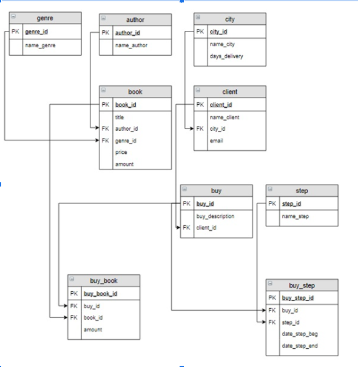

## База данных Book_store
_______
1. Схема базы данных:


2. *Установка*

* Клонируйте репозиторий:
```bash
   git clone https://github.com/valyaplotnikova/BD.git
   cd 
   ```

* Создайте виртуальное окружение и активируйте его:
```bash
   python -m venv venv
   source venv/bin/activate  # Для Linux/Mac
   venv\Scripts\activate  # Для Windows 
   ```

* Установите зависимости:

```bash
   pip install -r requrements.txt
   ```
* Заполните файл .env.sample своими данными и переименуйте его в .env    

* Введите в терминале
```bash
psql -U your_user
CREATE DATABASE book_store;
```
* Запустите файл main.py:
```bash
   python main.py
   ```
